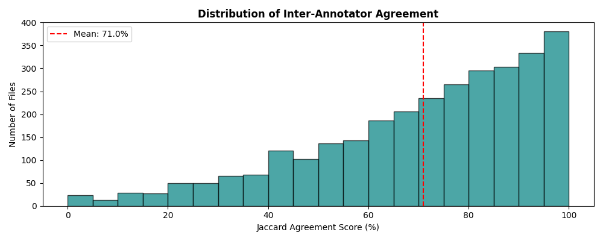
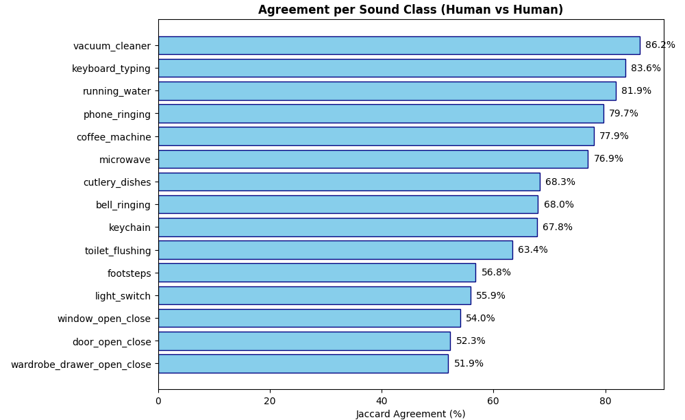
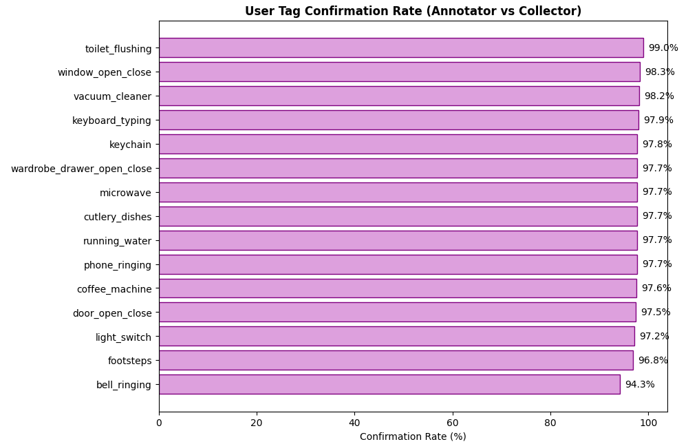
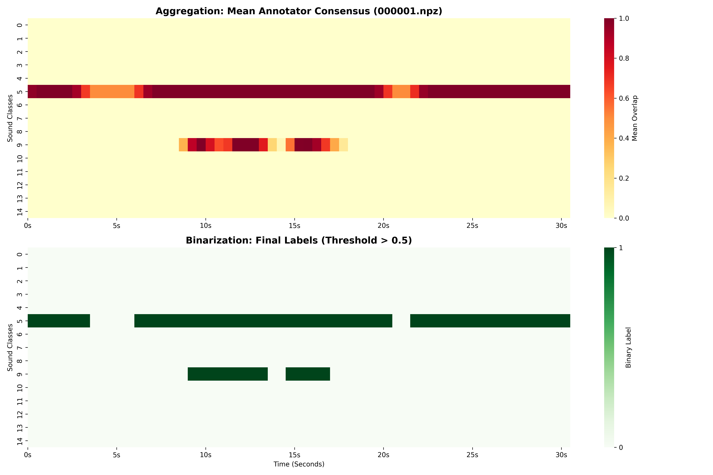
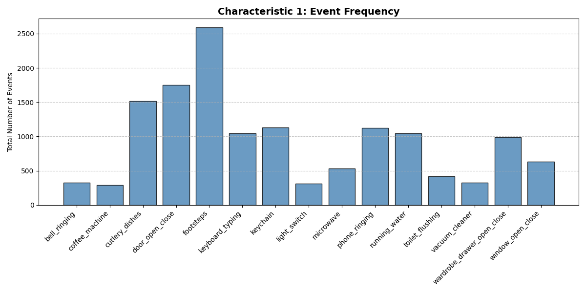
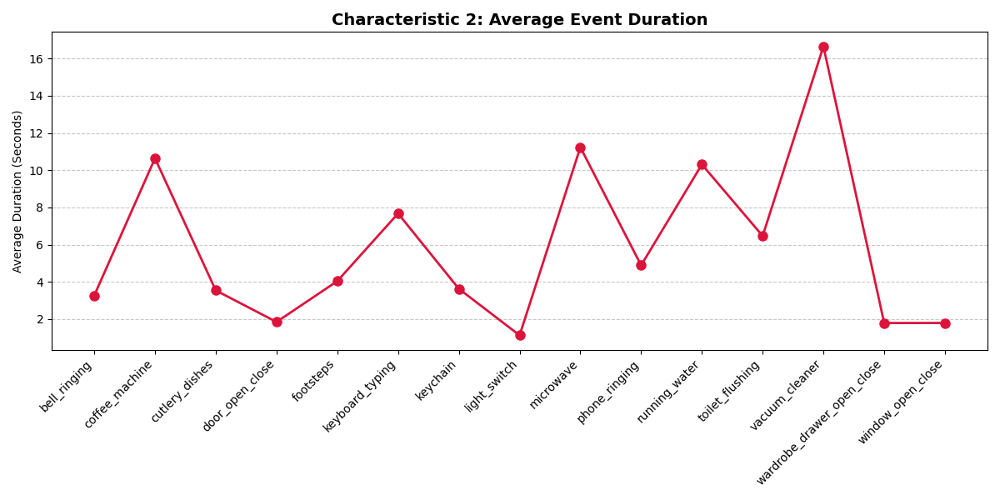
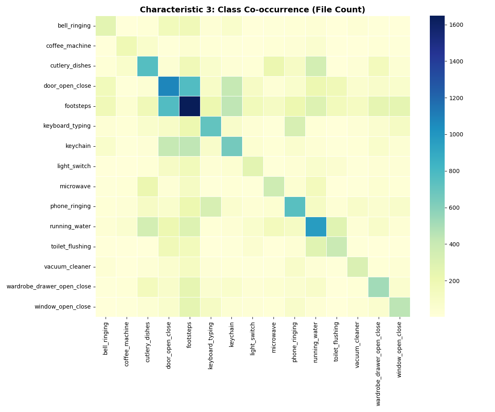

# Phase 03: Data Quality Audit & Label Engineering

## 📌 Module Overview
This module establishes the critical **Quality Assurance (QA)** and **Label Engineering** pipeline for the Sound Event Detection (SED) system. By auditing multi-annotator crowdsourced data and implementing a temporal binarization engine, I converted subjective human observations into a high-fidelity ground truth for machine learning.

## 🛠️ Technical Implementations

### 1. Inter-Annotator Reliability (IAR) Audit
I quantified the consistency of temporal boundaries across the 3,600+ recording dataset using the **Jaccard Similarity (Intersection over Union)** metric.

*   **Global Performance:** Achieved an overall mean agreement of **71.0%**.
*   **Distribution Analysis:** The dataset exhibits a strong right-skewed distribution; while the mean is 71%, the majority of files show high consensus (80%–100%), with variance primarily occurring in complex overlapping scenes.
*   **Class-Specific Stability:** 
    *   **High Stability:** Continuous sounds like `vacuum_cleaner` (**86.2%**) and `keyboard_typing` (**83.6%**).
    *   **High Variance:** Brief mechanical sounds like `wardrobe_drawer_open_close` (**51.9%**).
*   **Key Finding:** Disagreement is a function of temporal precision. Minor boundary mismatches on short-duration events significantly penalize the IoU score compared to long-duration events.

### 2. Ground-Truth Validation
To ensure data provenance, I cross-referenced human annotations against original user metadata tags.
*   **Result:** Achieved a **User Tag Confirmation Rate of 94.3% – 99.0%** across all classes.
*   **Impact:** This confirms that the initial data collection phase was highly accurate, providing a reliable foundation for supervised learning.

### 3. Label Engineering Pipeline (Binarization)
I developed a modular engine to collapse multi-annotator overlap data into objective binary targets ($0$ or $1$). 
*   **Engine Logic:** Calculated mean consensus per 1-second segment and applied a **Majority-Rule Threshold (0.5)**.
*   **Audit Case Study (Recording 000001.npz):** Visualizing the pipeline results identified two critical "Binarization Artifacts":
    *   **Fragmentation:** Continuous typing was split into three fragments where consensus briefly dipped below 0.5.
    *   **Erasure (False Negatives):** Short, low-consensus events—such as the final phone ring at ~18s—were removed for failing to meet the majority threshold.

### 4. Dataset Profiling
Post-derivation, I performed a statistical profile of the ground-truth label set:
*   **Class Imbalance:** Identified that `footsteps` (~2,600 events) dominate specific classes like `coffee_machine` (~300 events) by a factor of 8.5.
*   **Temporal Characteristics:** Quantified a clear split between **Continuous** events (averaging >16s) and **Transient** events (averaging ≈1s).
*   **Contextual Hubs:** Generated a **Co-occurrence Matrix** proving that sounds cluster logically by environment (e.g., Kitchen appliances). `Footsteps` acts as a universal class, co-occurring with nearly all domestic activities.

---

## 📊 Technical Visualizations

| Metric | Visualization |
| :--- | :--- |
| **IAR Distribution** |  |
| **Class Reliability** |  |
| **User Confirmation** |  |
| **Pipeline Logic** |  |
| **Class Frequency** |  |
| **Temporal Duration** |  |
| **Co-occurrence** |  |

---

## 🚀 Impact on Phase 04 (Classification)
The insights from this audit directly dictate the architecture of the upcoming training phase:
1.  **Metric Selection:** Shifted evaluation from Accuracy to **F1-Macro** to account for the heavy class imbalance.
2.  **Loss Weighting:** Recommended class-weighted loss functions to prioritize rare appliance sounds.
3.  **Temporal Resolution:** Identified a need for the model to "re-connect" fragmented events caused by the high binarization threshold.
