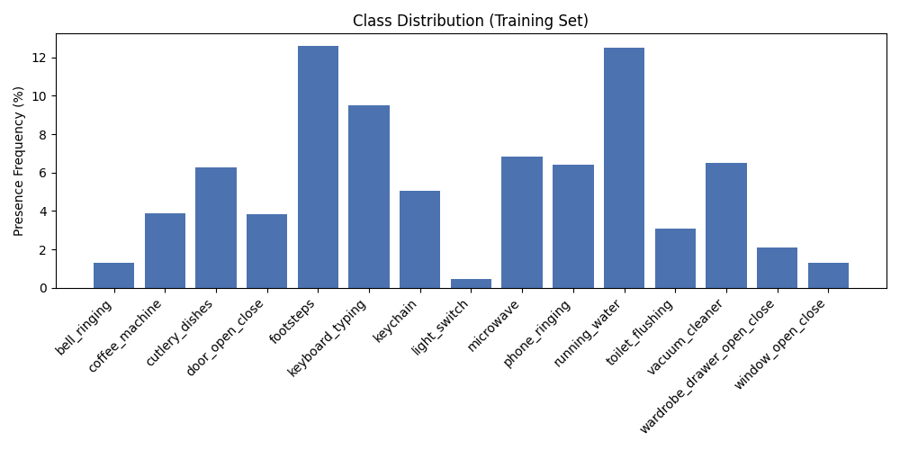
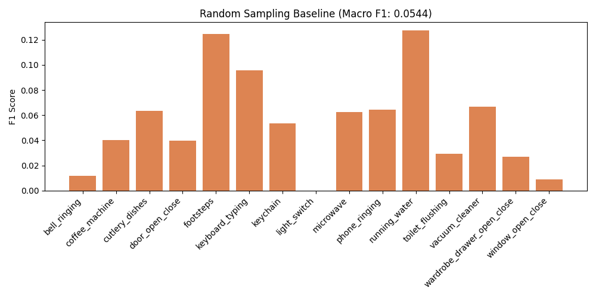
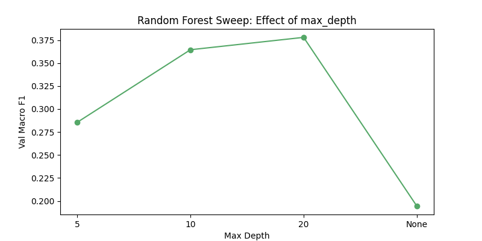
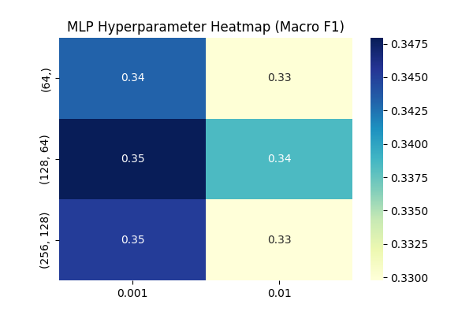
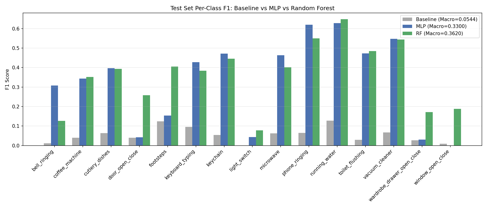
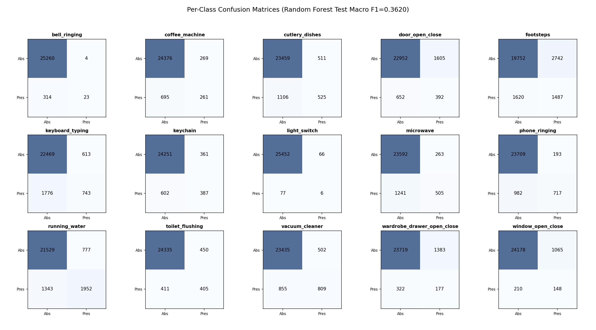

# Phase 04: Multi-label Classification

## 📌 Module Overview
This module transitions the project from data engineering to predictive modeling. The primary objective was to develop a robust system capable of identifying 15 domestic sound classes within overlapping acoustic environments. By implementing a multi-label classification framework, I evaluated the performance of ensemble methods (**Random Forest**) against deep learning architectures (**Multi-Layer Perceptron**) to establish a high-fidelity performance baseline.

## 🛠️ Technical Implementations

### 1. Leakage-Free Data Splitting
To ensure the models learned generalizable acoustic features rather than memorizing specific room environments or recording device signatures, I implemented a **Collector-Level Split**:
*   **Methodology:** All recordings from a single `collector_id` were restricted to one specific split (70% Train, 15% Val, 15% Test).
*   **Stratification:** The split was stratified based on collector contribution size (small, medium, and large contributors) to maintain consistent class distributions across all datasets.
*   **Significance:** This prevented information leakage and ensured the validation set served as a reliable proxy for real-world performance.

### 2. Baseline Establishment
A **Random Sampling Baseline** was established to provide a statistical "floor" for the classification task:
*   **Logic:** Predictions were generated by sampling from the training set's empirical class frequencies.
*   **Result:** The baseline achieved a **Macro $F_1$ of 0.0544**. Any model failing to significantly exceed this score would be considered non-predictive.

### 3. Classifier Optimization
Both models were wrapped in a `MultiOutputClassifier`, allowing the system to handle overlapping sound events by treating each class as an independent binary classification problem.

#### **Random Forest (RF)**
*   **Optimization:** A hyperparameter sweep was conducted over `max_depth`.
*   **Key Finding:** Fully grown trees (`max_depth=None`) resulted in severe overfitting with an $F_1$ of ~0.19. The optimal peak was found at a depth of **20**, yielding a **Val Macro $F_1$ of ~0.378**.

#### **Multi-Layer Perceptron (MLP)**
*   **Optimization:** Investigated the relationship between network capacity (architecture) and convergence speed (learning rate).
*   **Key Finding:** A two-layer architecture **(128, 64)** with a learning rate of **0.001** provided the best stability. Larger networks showed diminishing returns, suggesting that performance is limited by label noise and data complexity rather than model capacity.

## 📊 Technical Visualizations

| Metric | Visualization |
| :--- | :--- |
| **Class Distribution** |  |
| **Baseline Performance** |  |
| **RF Hyperparameter Sweep** |  |
| **MLP Hyperparameter Sweep** |  |
| **Final Model Comparison** |  |
| **Error Analysis (Confusion Matrix)** |  |

## 📈 Final Performance Summary

| Model | Test Macro $F_1$ |
| :--- | :--- |
| Random Sampling Baseline | 0.0544 |
| Multi-Layer Perceptron (128, 64) | 0.3300 |
| **Random Forest (max_depth=20)** | **0.3620** |

### **Performance Insights:**
*   **Reliable Classes:** The system excels at detecting continuous, spectrally distinctive sounds such as `running_water` and `vacuum_cleaner`.
*   **Challenging Classes:** Short, transient events like `light_switch` and `window_open_close` remain difficult to detect at the segment level, as they are often overshadowed by louder, background appliances.
*   **Model Robustness:** Random Forest outperformed the MLP, demonstrating better resilience to the class imbalance and noisy labels present in crowdsourced domestic audio.

## 🚀 Roadmap for Phase 05
The results from Phase 04 confirm that while segment-level classification is effective for continuous sounds, it lacks the temporal context needed for short-duration events. Phase 05 will focus on **Convolutional Recurrent Neural Networks (CRNNs)** to leverage both spectral features and temporal dependencies.
