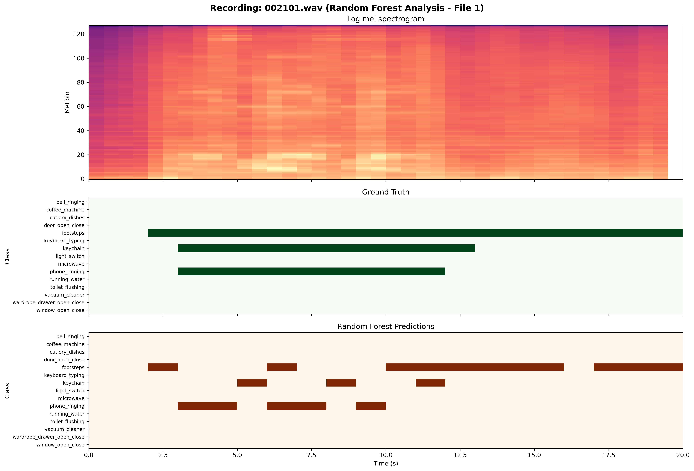

# Phase 05: Production Deployment & Challenge

## 📌 Module Overview
This final phase represents the transition from segment-level classification to full **Sound Event Detection (SED)**. The objective was to build a production-ready system capable of predicting not only the class of a sound but its precise **onset and offset timestamps** in continuous audio. This module covers high-dimensional feature optimization, temporal regularization, and a qualitative audit of model behavior in complex domestic scenes.

## 🛠️ Technical Implementations

### 1. Baseline Reproduction
*   **System:** 15 independent Decision Trees (Binary Relevance).
*   **Methodology:** Audio was processed using a 1-second window with a 0.5-second hop size.
*   **Result:** Established a performance "floor" of **Macro $F_1 = 0.313$**. 
*   **Detailed Metrics:** The table below (from the instructor-provided evaluation) shows that while the baseline achieves decent precision on continuous sounds, its recall is significantly penalized on transient events like `window_open_close`.

### 2. Classifier Optimization ("Smart Limit" RF)
The feature space increased to **960 dimensions** for this challenge. To prevent the Random Forest from memorizing statistical noise, I implemented a "Smart Limit" regularization strategy:
*   **Configuration:** `min_samples_leaf=10` and `max_depth=None`. This allows trees to grow deeply only where evidence is dense and reliable.
*   **Scaling:** Sweeping `n_estimators` revealed that 50 trees achieved the performance ceiling (**Macro $F_1 = 0.4636$**) before hitting diminishing returns.

### 3. Temporal Refinement (Median Filtering)
Raw model outputs often suffered from "salt-and-pepper" noise (momentary dropouts). I implemented an edge-preserving **Median Filter (Window=3)** to stabilize the predictions.
*   **The Engineering Trade-off:** As shown in the Delta Plot below, while the filter successfully "bridged" gaps in continuous sounds like `keyboard_typing` (Green), it acted as a destructive low-pass filter for transient sounds like `window_open_close` (Red), erasing them entirely.

## 📊 Qualitative Analysis & Case Studies

| Case Study | Visualization | Key Insight |
| :--- | :--- | :--- |
| **Audit File 1** |  | Analysis of 1-second dropouts (flickering) in the `keychain` and `footsteps` classes. |
| **Audit File 2** |  | Identified class confusion between spectrally similar hums (Microwave vs. Coffee Machine). |

## 📈 Final Performance Summary

| Model Configuration | Macro $F_1$ Score |
| :--- | :--- |
| Decision Tree Baseline | 0.3130 |
| Optimized Random Forest (Raw) | **0.4721** |
| **RF + Median Filter (Refined)** | **0.4668** |

## 🔍 Reflection & Real-World Considerations
*   **Edge Deployment:** Processing 960 features per second through an ensemble of 50 trees is computationally expensive. For real-world smart-home deployment (e.g., on a smart speaker), a highly quantized or distilled model would be required.
*   **Safety vs. Latency:** The Window=3 Median Filter requires a 1-second "look-ahead." In safety-critical scenarios, such as detecting a breaking window, this 1-second delay must be weighed against the benefit of reduced false alarms.
*   **Future Roadmap:** To truly solve the "overlap" problem identified in the case studies, the system should migrate to **CRNNs (Convolutional Recurrent Neural Networks)** to natively model temporal dependencies without manual post-processing.
