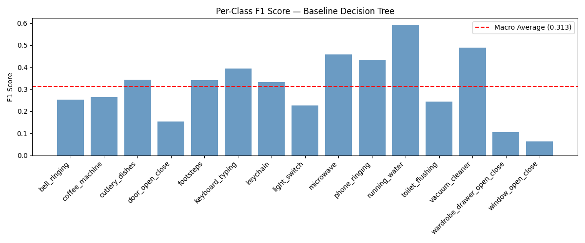
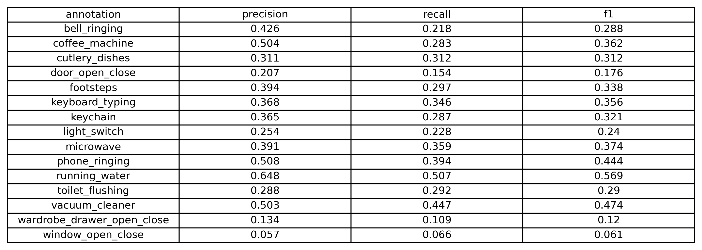
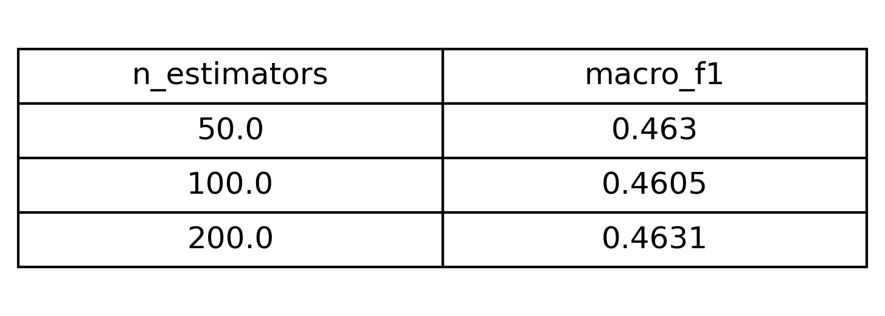
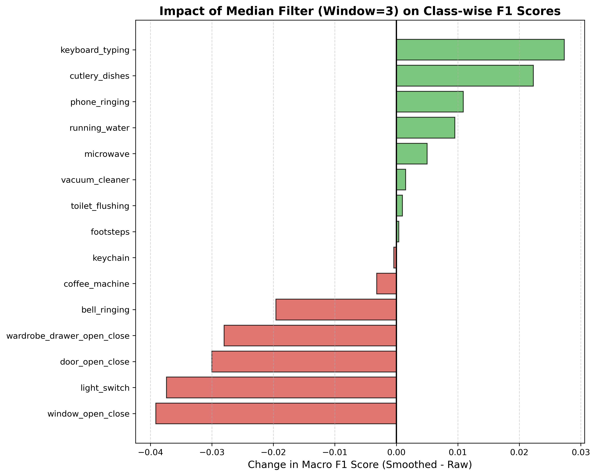
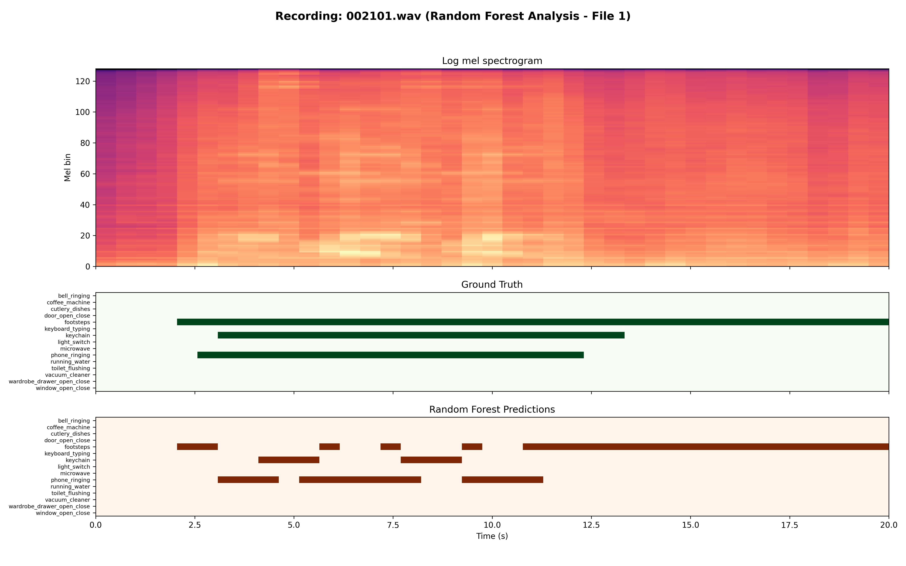
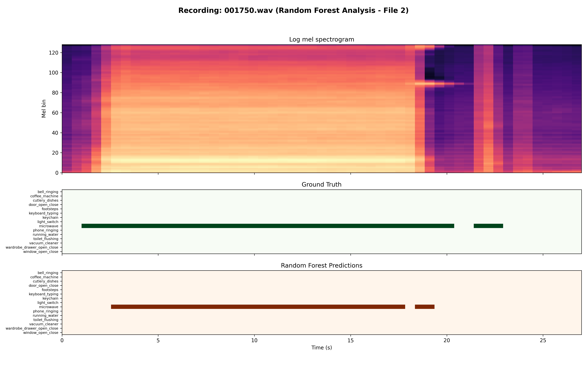

# Phase 05: Production Deployment & Challenge

## 📌 Module Overview
The final phase of the project marks the transition from segment-level classification to full **Sound Event Detection (SED)**. The primary objective was to build a system capable of predicting the precise **onset and offset timestamps** for 15 domestic sound classes in continuous audio recordings. This module documents the high-dimensional optimization of an ensemble architecture and the implementation of a temporal refinement engine to ensure production-grade stability.

## 🛠️ Technical Implementations

### 1. Baseline Reproduction & Gap Analysis
*   **System:** 15 independent Decision Trees (Binary Relevance).
*   **Methodology:** Audio processed in 1s windows with a 0.5s hop size.
*   **Split Consistency:** The model demonstrated high generalization consistency between the validation and non-hidden test sets (Macro $F_1$ ~0.31).
*   **Recall Challenges:** Detailed metrics revealed a "Recall Gap"—while the baseline maintains decent precision, it fails to capture transient events like `light_switch`, which are diluted by silence in the 1s windows.

| Split Consistency | Detailed Baseline Metrics |
| :--- | :--- |
|  |  |

### 2. High-Dimensional Optimization ("Smart Limit" RF)
With the feature space expanded to **960 dimensions**, I moved to a regularization strategy based on evidence density:
*   **Regularization:** Used `min_samples_leaf=10` with `max_depth=None`. This allows trees to grow deeply where patterns are clear while automatically pruning branches with insufficient statistical support.
*   **Efficiency:** A sweep of `n_estimators` proved that 50 trees reached the performance ceiling (**Macro $F_1 = 0.4636$**) before hitting diminishing returns.

### 3. Temporal Refinement (Median Filtering)
Qualitative analysis identified "salt-and-pepper" noise in raw predictions, where continuous events suffered from momentary dropouts. I implemented an edge-preserving **Median Filter (Window=3)**.
*   **The Engineering Trade-off:** As shown in the Delta Plot below, while the filter successfully stabilized continuous sounds like `keyboard_typing` (Green), it acted as a destructive low-pass filter for transient sounds (Red), erasing genuine short-duration detections.

## 🧠 Model Artifacts & Reproduction
To maintain a lightweight repository and adhere to data privacy guidelines, the trained model weights (`best_rf_model.pkl`) are not included. 

**To reproduce the model:**
1. Place the `MLPC2026_challenge` dataset in the root directory.
2. Run `python src/02_rf_optimization.py`.
3. The script will generate the model file locally for use in the inference and audit scripts.

## 📊 Qualitative Error Analysis (Case Studies)
I performed a high-resolution audit of complex kitchen scenes, aligning Mel-Spectrograms with Ground Truth and model outputs.

| File Audit | Visualization | Key Insight |
| :--- | :--- | :--- |
| **Case Study 1** |  | Successfully captured the `phone_ringing` sequence but identified 1s flickering in the `keychain` class. |
| **Case Study 2** |  | Revealed spectral confusion between `microwave` and `coffee_machine` hums. |

## 📈 Final Performance Summary

| Model Configuration | Macro $F_1$ Score |
| :--- | :--- |
| Decision Tree Baseline | 0.3130 |
| Optimized Random Forest (Raw) | **0.4721** |
| **Optimized RF + Median Filter (Final)** | **0.4668** |

## 🔍 Roadmap
The next architectural iteration will move toward **Convolutional Recurrent Neural Networks (CRNNs)** to natively model temporal dependencies end-to-end.
